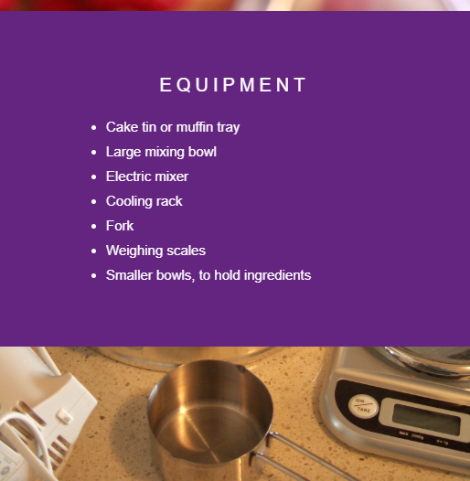

## Get started

--- task ---

Open the starter project.

Since you're using GitHub, the files should be downloaded through Clone into GitHub Desktop. They will show up in your File Explorer. Open the `index.html` file using Visual Studio Code.

--- /task ---

In the `index.html` file, there are some pieces of content in `div` elements. 

The CoderDojo logo is displayed using an empty `div` with the CSS property ```background-image```.

--- task ---

In the `index.html` file, create another `div` with an image of some kitchen equipment.

Add a `div` element to the bottom of your page, **inside** the `<html>` tags, start the new code at ** Line 24 ** . Give the `div` a helpful class name, e.g. `kitchen-equipment`.

```html
  <div class="kitchen-equipment">

  </div>
  ```

--- /task ---

--- task ---

Go to the ```style.css``` file, and add a CSS rule-set for your new class, including the link to the image you want to display.
```css
  .kitchen-equipment {
    background-image: url("utensils.JPG");
  }
```
--- /task ---

--- task ---

+ In the CSS file, ** add ** the new class name, `kitchen-equipment`,  to the list of selectors for the `cd-logo` rule-set that is ** already there ** .
```css
  .cd-logo, .kitchen-equipment {
  position: relative;
  background-position: center;
  background-repeat: no-repeat;
  background-color: #642580;
  background-size: cover;
  min-height: 100%;
}
```
Now, all these property and value pairs apply to your new background image.

Scroll through your web page, and you should now see the new image.
--- /task ---

--- task ---

Add more `div` elements with pictures or text in the `index.html` file. 

The example below shows you how to add:
+ A list of the equipment for baking a cake
+ A picture of the cake ingredients

To add a section with text, include any HTML tags you want inside a `div`. Then, add the appropriate CSS rules. The starter project already includes `<p>` and `<h3>` tags in the 'simple chocolate cake' section. The example section below uses `<ul>` and `<li>` tags. Add the class name `textSection` to your new section to apply the same CSS rules that apply to the 'simple chocolate cake' section.

```html
<div class="textSection">
    <h3>EQUIPMENT</h3>
    <ul>
     <li>Cake tin or muffin tray</li>
     <li>Large mixing bowl</li>
     <li>Electric mixer</li>
     <li>Cooling rack</li>
     <li>Fork</li>
     <li>Weighing scales</li>
     <li>Smaller bowls, to hold ingredients</li>
    </ul>
  </div>
```

To add a section with an image, create a `div` element and give it a class name. Then use the CSS property `background-image` to add an image to the new`div` element.

```html
  <div class="cake-ingredients">

  </div>
  ```

Here is the CSS code for `style.css` to assign a background image to your new `div`:

```css
  .cake-ingredients {
    background-image: url("ingredients.jpg");
  }
```

** Add ** your new `div` element's class name, `cake-ingredients`, to the list of selectors for the ** existing ** CSS rule.

```css
  .cd-logo, .kitchen-equipment, .cake-ingredients {
  position: relative;
  background-position: center;
  background-repeat: no-repeat;
  background-color: #642580;
  background-size: cover;
  min-height: 100%;
}
```

--- /task ---
### Check your index page with the preview image, AfterStep2.png



---
Go to step_3.md for your next instructions
---

