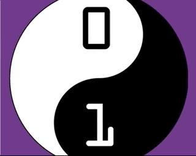
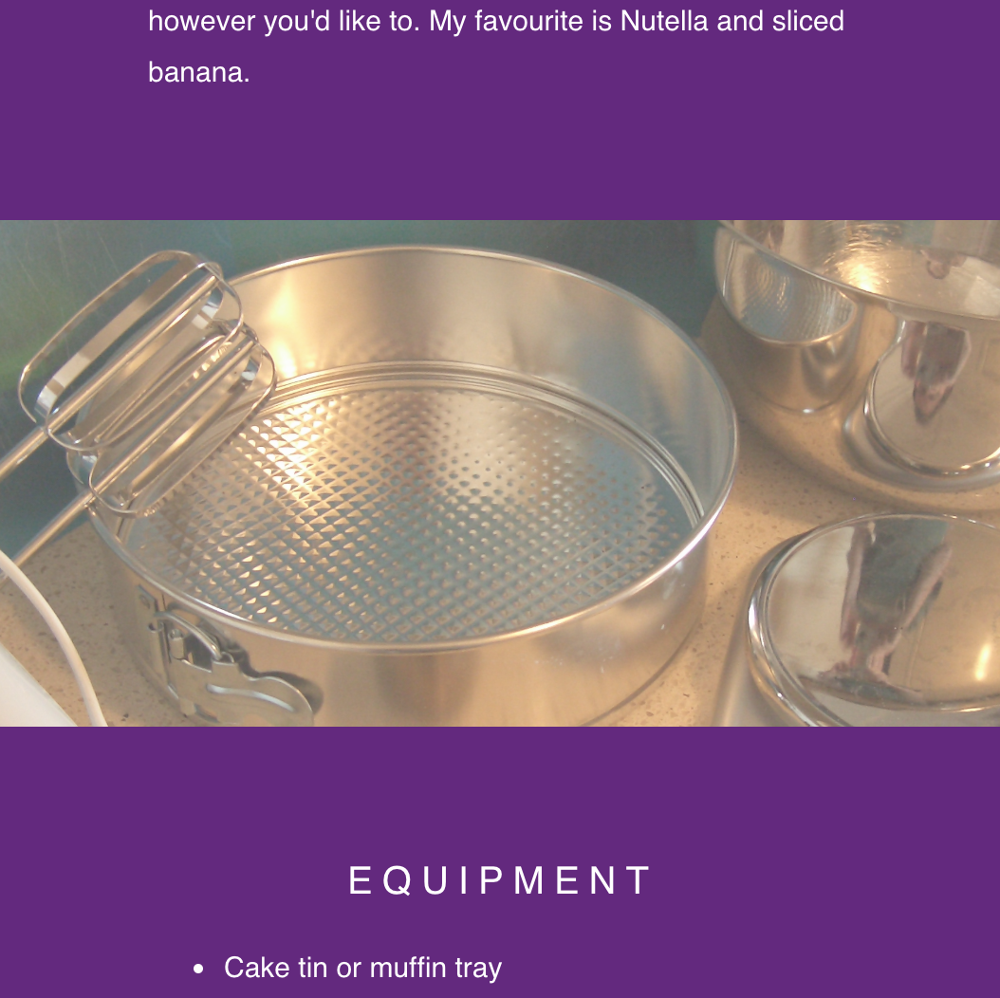

## Add parallax scroll

Parallax scrolling is when background content on a web page moves at a different speed to the foreground content. You can preview this effect at the image ** ParallaxDemo.gif **.



It's time to add the parallax effect to your web page! 

--- task ---

In `style.css`, find the following CSS rule-set, ** add ** the property `background-attachment` and give it the value `fixed`.

```css
.cd-logo, .kitchen-equipment, .cake-ingredients{
  position: relative;
  background-position: center;
  background-repeat: no-repeat;
  background-color: #642580;
  background-size: cover;
  min-height: 100%;

  background-attachment: fixed;  //Add this line
}
```
--- /task ---

--- task ---
If you want to adjust the size of the gap between text sections, change the `min-height` property. Experiment with different sizes and choose a value between `0%` and `100%` .
--- /task ---

--- task ---
If you want to make the `div` elements slightly see-through, add the `opacity` property to the CSS rule-set. Try some values between `0.1` and `1`.

The image ** AfterStep3.png ** shows the effect of setting the `opacity` property to `0.7`.



--- /task ---

If your last section on your web page is too short, so that some of the picture shows when you scroll all the way to the bottom of the page, then add a new rule-set to set that section's ```min-height```  to `100%`.

Here is how your new rule-set might look:
```css
  .cd-logo, .kitchen-equipment, {
  position: relative;
  background-position: center;
  background-repeat: no-repeat;
  background-color: #642580;
  background-size: cover;

  background-attachment: fixed;
  min-height: 50%;
  opacity: 0.7;
}
```

---
Go to step-4.md for the next instructions
---
